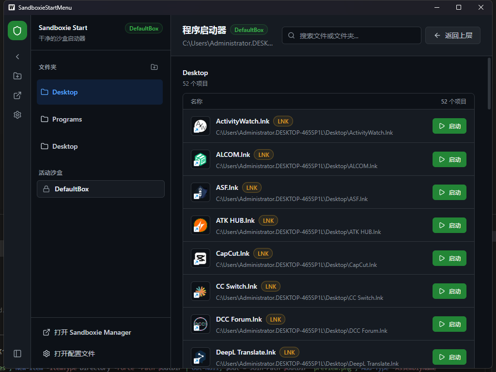

# Better Sandboxie Plus Start Menu


一个为 Windows Sandboxie 设计的增强型开始菜单应用程序，提供更好的程序启动体验和沙盒管理功能。

## 预览



## ✨ 主要特性

### 🎯 核心功能
- **程序启动器**：浏览并启动选定文件夹中的可执行文件（.exe、.bat、.cmd）
- **沙盒集成**：在指定的 Sandboxie 沙盒中启动程序
- **文件夹管理**：添加、移除和切换包含程序的文件夹
- **智能侧边栏**：可收起/展开的侧边栏，节省屏幕空间
- **完整中文化**：所有用户界面元素均已翻译为中文

### 🎨 用户体验
- **现代UI设计**：使用 Tailwind CSS 构建的现代化界面
- **主题支持**：自动跟随系统深色/浅色主题
- **状态持久化**：自动保存应用状态，重启后恢复所有设置
- **响应式布局**：适配不同屏幕尺寸
- **滚动条优化**：自定义滚动条样式，与主题完美匹配

### ⚙️ 沙盒管理
- **多沙盒支持**：管理多个 Sandboxie 沙盒配置
- **运行时询问**：支持 `__ask__` 选项，启动时选择沙盒
- **沙盒管理器**：添加、移除和切换活动沙盒
- **默认沙盒保护**：内置 `DefaultBox` 和 `__ask__` 选项无法删除

## 🚀 快速开始

### 系统要求
- **Windows 10/11** 操作系统
- **Sandboxie Plus** 或 **Sandboxie Classic** 已安装
- **Go 1.21+** （仅开发需要）
- **Node.js 18+** （仅开发需要）

### 下载安装
1. 从 [Releases](https://github.com/yourusername/Better-SandboxiePlus-StartMenu/releases) 下载最新版本
2. 解压到任意目录
3. 运行 `SandboxieStartMenu.exe`

### 使用方法
1. **添加文件夹**：点击"添加文件夹"按钮选择包含程序的文件夹
2. **选择沙盒**：在"活动沙盒"下拉菜单中选择要使用的沙盒
3. **启动程序**：点击程序卡片的"启动"按钮
4. **管理文件夹**：右键文件夹或点击×图标移除文件夹
5. **收起侧边栏**：点击左上角 ← 箭头收起侧边栏，→ 箭头展开

## 🛠️ 开发指南

### 环境搭建
```bash
# 安装 Wails CLI
go install github.com/wailsapp/wails/v2/cmd/wails@latest

# 安装前端依赖
cd frontend
npm install
```

### 开发模式运行
```bash
# 启动开发服务器（热重载）
wails dev
```

### 生产构建
```bash
# 构建可执行文件
wails build

# 清理构建
wails build -clean

# 构建位置：build/bin/SandboxieStartMenu.exe
```

### 项目结构
```
SandboxieStartMenu/
├── app.go                 # 主应用逻辑和Wails绑定
├── config.go              # 配置管理（JSON持久化）
├── filemanager.go         # 文件系统操作
├── sandboxie.go           # Sandboxie集成
├── types.go               # 数据结构定义
├── main.go                # Wails入口点
├── wails.json             # Wails配置文件
├── frontend/
│   ├── src/
│   │   ├── App.jsx        # 主React组件
│   │   ├── main.jsx       # React入口点
│   │   ├── index.css      # 基础样式
│   │   └── components/    # React组件库
│   │       ├── Sidebar.jsx       # 侧边栏（支持收起）
│   │       ├── MainContent.jsx   # 主内容区
│   │       ├── FolderList.jsx    # 文件夹列表
│   │       ├── FileList.jsx      # 文件列表
│   │       ├── FileItem.jsx      # 文件项
│   │       ├── SandboxSelector.jsx # 沙盒选择器
│   │       ├── SandboxManager.jsx  # 沙盒管理器
│   │       └── Toast.jsx          # 通知组件
│   ├── index.html         # HTML入口
│   ├── package.json       # 前端依赖
│   └── wailsjs/           # 自动生成的绑定
└── build/
    └── bin/
        └── SandboxieStartMenu.exe  # 构建输出
```

## ⚙️ 配置说明

### 配置文件位置
```
%APPDATA%\SandboxieStartMenu\config.json
```

### 配置文件结构
```json
{
  "folderPaths": ["C:\\Program Files", "C:\\Windows"],
  "currentFolder": "C:\\Program Files",
  "selectedSandbox": "DefaultBox",
  "availableSandboxes": ["DefaultBox", "__ask__", "TestBox"]
}
```

### 配置字段说明
- **folderPaths**：用户添加的文件夹路径列表
- **currentFolder**：当前选中的文件夹
- **selectedSandbox**：当前选中的沙盒
- **availableSandboxes**：可用沙盒列表（始终包含 DefaultBox 和 __ask__）

## 🔧 技术栈

### 后端 (Go)
- **Wails v2.11.0** - 桌面应用框架
- **Go Modules** - 依赖管理
- **JSON 持久化** - 配置存储
- **Windows API 集成** - 文件系统操作

### 前端 (React)
- **React 18.2.0** - UI框架
- **Vite** - 构建工具和开发服务器
- **Tailwind CSS 3.3.0** - 样式框架
- **PostCSS + Autoprefixer** - CSS处理
- **JSX** - React组件语法

### 构建工具
- **Wails CLI** - 应用构建和开发
- **npm** - 前端依赖管理
- **Go Compiler** - Go代码编译

## 📝 常见问题

### Q: 应用无法检测到 Sandboxie
A: 确保 Sandboxie 已正确安装在以下位置之一：
- `C:\Program Files\Sandboxie-Plus\Start.exe`
- `C:\Program Files\Sandboxie\Start.exe`
- `C:\Program Files (x86)\Sandboxie\Start.exe`

### Q: 侧边栏收起状态未保存
A: 侧边栏状态保存在浏览器的 localStorage 中，清理浏览器缓存可能导致状态丢失。

### Q: 配置文件损坏
A: 删除 `%APPDATA%\SandboxieStartMenu\config.json` 文件，重新启动应用。

### Q: 无法移除 DefaultBox 或 __ask__
A: 这是设计行为，这两个沙盒选项是必需的，无法删除。

## 🤝 贡献指南

1. Fork 本仓库
2. 创建功能分支 (`git checkout -b feature/AmazingFeature`)
3. 提交更改 (`git commit -m 'Add some AmazingFeature'`)
4. 推送到分支 (`git push origin feature/AmazingFeature`)
5. 开启 Pull Request

### 开发规范
- 前端组件使用函数式组件和 React Hooks
- 样式使用 Tailwind CSS 类名
- Go 代码遵循 Go 语言规范
- 提交信息使用英文

## 📄 许可证

本项目采用 MIT 许可证 - 查看 [LICENSE](LICENSE) 文件了解详情。

## 🙏 致谢

- [Wails](https://wails.io/) - 优秀的 Go 桌面应用框架
- [Sandboxie Plus](https://sandboxie-plus.com/) - 出色的 Windows 沙盒软件
- [React](https://reactjs.org/) - 声明式 UI 框架
- [Tailwind CSS](https://tailwindcss.com/) - 实用的 CSS 框架

## 📞 支持与反馈

- **问题报告**：请使用 GitHub Issues
- **功能建议**：欢迎提交 Pull Request 或 Issue
- **讨论交流**：可在 Issues 中讨论相关话题

---

**Happy Sandboxing! 🚀**
